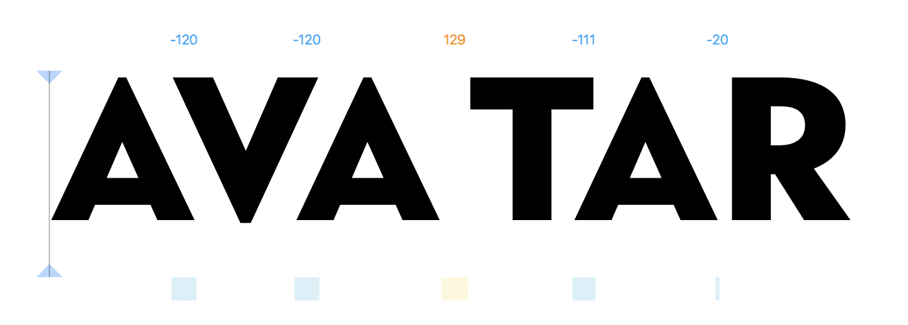

# Kerning Values

This is a plugin for the font editor Glyphs.app. It shows the kerning values above the typed text in Edit view, like this:

### Installation

1. One-click install *Kerning Values* from *Window > Plugin Manager.*
2. Restart Glyphs.

### Usage Instructions

1. Open at least two glyphs in Edit View.
2. Use *View > Show Kerning Values* (de: *Ansicht > Zeige Kerning-Werte*, es: *Ver > Mostrar valores de Kerning*, fr: *Affichage > Afficher valeurs de crénage*) to toggle the display of the kerning values.

It will not display if you put the cursor *after* all text in Edit view.

### Requirements

The plug-in works in Glyphs 2.5.2 in High Sierra. I can only test it in current app and OS versions, and perhaps it works on earlier versions too.

### License

Copyright 2018 Rainer Erich Scheichelbauer (@mekkablue).
Based on sample code by Georg Seifert (@schriftgestalt) and Jan Gerner (@yanone).

Licensed under the Apache License, Version 2.0 (the "License");
you may not use this file except in compliance with the License.
You may obtain a copy of the License at

http://www.apache.org/licenses/LICENSE-2.0

See the License file included in this repository for further details.
